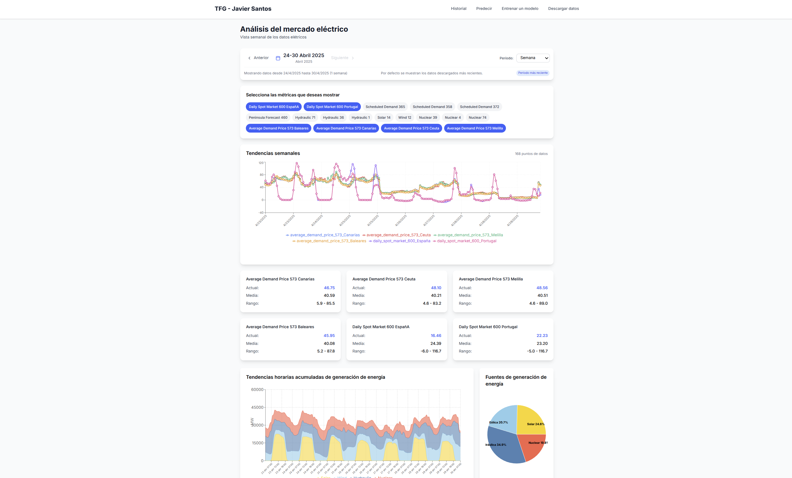

# Time Series Forecasting on the Spanish Electricity Market

This project is the Final Year Thesis (TFG) of **Javier Santos**, focused on building and deploying neural network models to make predictions on time series data from the Spanish electrical market.

Originally developed as a set of Python scripts and Jupyter notebooks for data preprocessing and modeling, the project has evolved into a full-stack web application. It includes:

- **A Django-based REST API** (`TensorFlow`-powered) that serves trained neural network models and facilitates data retrieval.
- **A React frontend with TypeScript and Tailwind CSS**, providing a clean, modern interface to:
  - Visualize time series plots
  - Train neural models
  - Make predictions from real data
- **Reusable scripts and notebooks** in the `scripts/` directory, suitable for offline experimentation and local analysis.

> The web app is in Spanish, as is the language of the final report.

---

## Setup Instructions

To get the application running locally (backend and frontend), please refer to [SETUP.md](SETUP.md).

---

## Contributions 

This project **does not accept contributions** as it is a personal academic work.

---

## Thanks

Thank you for reading, and I hope you enjoy this project!
